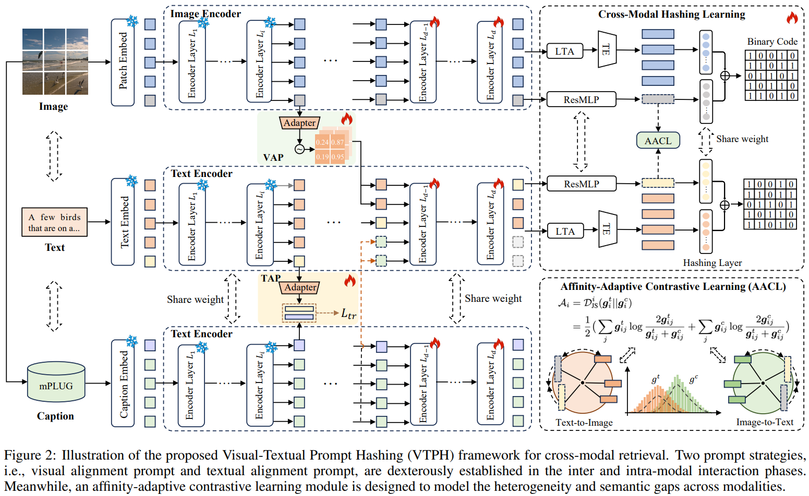

# VTPH

# Enhancing Cross-Modal Retrieval via Visual-Textual Prompt Hashing


### 1. Introduction

This is the source code of IJCAI 2024 paper "Enhancing Cross-Modal Retrieval via Visual-Textual Prompt Hashing".

The main architecture of VTPH:




### 2. Requirements

- python 3.7.16
- pytorch 1.9.1
- torchvision 0.10.1
- numpy
- scipy
- tqdm
- pillow
- einops
- ftfy
- regex
- hdf5storage
- ...


### 3. Preparation

#### 3.1 Download pre-trained CLIP

Pretrained CLIP model could be found in the 30 lines of [CLIP/clip/clip.py](https://github.com/openai/CLIP/blob/main/clip/clip.py). 
This code is based on the "ViT-B/32". 
You should download "ViT-B/32" and put it in `./cache`.

#### 3.2 Generate dataset

The `*.mat` files for each dataset are required for training. For the caption file, you can use image caption model to obtain annotations for images of the datasets. The file structure follows [MITH](https://github.com/DarrenZZhang/MM23-MITH).

The directory  structure of `./dataset` should be:

```
    dataset
    ├── coco
    │   ├── caption.mat 
    │   ├── index.mat
    │   ├── label.mat 
    │   └── image_caption.mat 
    ├── flickr25k
    │   ├── caption.mat
    │   ├── index.mat
    │   ├── label.mat
    │   └── image_caption.mat 
    └── nuswide
        ├── caption.mat
        ├── index.mat 
        ├── label.mat
        └── image_caption.mat 
```

Please preprocess the dataset to the appropriate input format.

### 4. Train

After preparing the Python environment, pretrained CLIP model, and dataset, we can train the VTPH model.
#### 4.1 Train on MIRFlickr25K
``` 
python main.py --gpu 0 --is-train --dataset flickr25k --query-num 2000 --train-num 10000 --result-name "RESULT_MITH_FLICKR" --k-bits 64
```

### 5. Test

During testing, our approach compensates for the  **unknown** modalities corresponding to the current modality of the text query set sample by providing supplementary information through generated data. To ensure the independence of text inputs, the image and caption generation models are additionally introduced to generate virtual images and corresponding captions for enhancing text embedding.

#### 5.2 Test on MIRFlickr25K

``` 
python main.py --gpu 0 --dataset flickr25k --query-num 2000 --train-num 10000 --result-name "RESULT_MITH_FLICKR" --k-bits 64 --pretrained=MODEL_PATH
```

More scripts for training and testing are given at `./run_VTPH.sh`. 


### 6. Citation
If you find our approach useful in your research, please consider citing:

```
@inproceedings{ijcai2024enhancing,
    title={Enhancing Cross-Modal Retrieval via Visual-Textual Prompt Hashing},
    author={Chen, Bingzhi and Wu, Zhongqi and Liu, Yishu and Zeng, Biqing and Lu, Guangming and Zhang, Zheng},
    booktitle={Proceedings of the Thirty-Third International Joint Conference on Artificial Intelligence, {IJCAI-24}},
    pages={623--631},
    year={2024}
}
```


### 7. Any question

If you have any questions, please feel free to contact Bingzhi Chen (chenbingzhi.smile@gmail.com) or Zhongqi Wu (wuzhongqi57@gmail.com).
